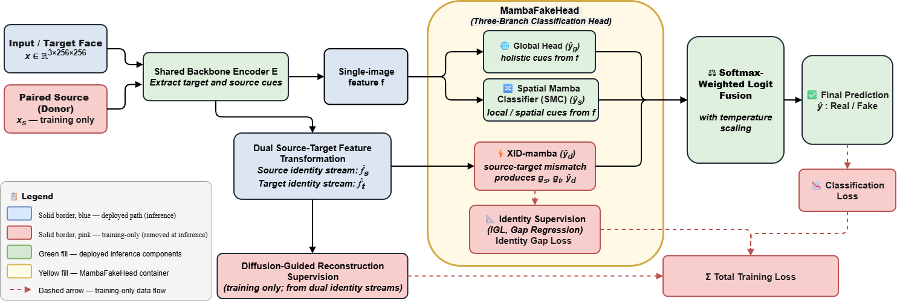

# DIMF: Dual-Identity Mamba Fusion for Source-Aware Deepfake Detection

> A PyTorch Lightning framework for detecting AI-generated / deepfake face images using a ControlNet-based diffusion backbone with Mamba-head feature filtering and multi-domain generalisation evaluation.

---

## Table of Contents

- [Overview](#overview)
- [Architecture](#architecture)
- [Requirements](#requirements)
- [Installation](#installation)
- [Dataset Setup](#dataset-setup)
- [Pretrained Model Download](#pretrained-model-download)
- [Training](#training)
- [Evaluation](#evaluation)
- [License](#license)

---

## Overview

DIMF combines a **Stable Diffusion / ControlNet backbone** with a **Mamba-based classification head** to detect diffusion-generated fake images. It supports:

- Multi-GPU DDP training via `torchrun`
- YAML-driven hyperparameters and ablation flags
- Cross-domain generalisation evaluation (frame-level + video-level AUC/EER)
- Automatic checkpoint resumption (`auto`, `auto_best`, or explicit path)
- WandB logging, EarlyStopping, LR scheduling

## Architecture
 


---

## Requirements

- Python ≥ 3.8
- CUDA-capable GPU(s)
- PyTorch 1.13.1 + torchvision 0.14.1

---

## Installation

```bash
# 1. Clone the repository
git clone https://github.com/aiai-9/DIMF.git
cd DIMF

# 2. Create and activate a virtual environment (recommended)
conda create -n dimf python=3.9 -y
conda activate dimf

# 3. Install PyTorch with CUDA (adjust cuda version as needed)
pip install torch==1.13.1+cu117 torchvision==0.14.1+cu117 \
    --extra-index-url https://download.pytorch.org/whl/cu117

# 4. Install all other dependencies
pip install -r requirements.txt
```

> **Note:** `dlib` requires CMake. On Ubuntu run `sudo apt-get install cmake` first.

---

## Dataset Setup

DIMF is designed for **face forgery / deepfake detection** datasets. The expected directory structure for each dataset is:

```
data/
├── FaceForensics++/          # FF++ (real + multiple forgery methods)
│   ├── original_sequences/
│   └── manipulated_sequences/
├── DFD/                      # DeepFakeDetection
├── DiffSwap/                 # Diffusion-based face swap
├── WildDeepfake/             # In-the-wild deepfakes
└── ...
```

### Supported Datasets

| Dataset | Type | Use |
|---------|------|-----|
| FaceForensics++ (FF++) | Landmark/GAN fakes | Train / Val |
| DeepFakeDetection (DFD) | GAN fakes | Eval |
| DiffSwap | Diffusion face swap | Eval |
| WildDeepfake | In-the-wild fakes | Eval |

### Downloading Datasets

- **FaceForensics++**: Request access at [https://github.com/ondyari/FaceForensics](https://github.com/ondyari/FaceForensics)
- **DFD (Google DeepFakeDetection)**: [https://ai.googleblog.com/2019/09/contributing-data-to-deepfake-detection.html](https://ai.googleblog.com/2019/09/contributing-data-to-deepfake-detection.html)
- **DiffSwap**: [https://github.com/diffswap/DiffSwap](https://github.com/diffswap/DiffSwap)
- **WildDeepfake**: [https://github.com/deepfakeinthewild/deepfake-in-the-wild](https://github.com/deepfakeinthewild/deepfake-in-the-wild)

Configure dataset paths in your `configs/train.yaml` under the `dataset:` block.

---

## Pretrained Model Download

DIMF initialises training from a **Stable Diffusion v1.5 ControlNet** checkpoint.

```bash
mkdir -p models

# Download SD1.5 ControlNet init weights
wget -O models/control_sd15_ini.ckpt \
  https://huggingface.co/lllyasviel/ControlNet/resolve/main/models/control_sd15_canny.pth
```

> Alternatively, download from [HuggingFace ControlNet](https://huggingface.co/lllyasviel/ControlNet) and rename to `models/control_sd15_ini.ckpt`.

The path is configured in `configs/train.yaml` as `resume_path` or passed directly to the trainer.

---

## Training

### Single GPU

```bash
CUDA_VISIBLE_DEVICES=0 python train.py -c configs/train.yaml
```

### Multi-GPU (recommended — 4 GPUs)

```bash
CUDA_VISIBLE_DEVICES=0,1,2,3 torchrun --nproc_per_node=4 train.py -c configs/train.yaml
```

### Training Output

Checkpoints and logs are saved to `exam_dir` as defined in your config:

```
experiments/<exp_name>/
├── ckpt/
│   ├── last.ckpt
│   └── best-eer-epoch=XX.ckpt
├── train.log
└── code/                   # Snapshot of training code
```

---

## Evaluation

Cross-dataset generalisation evaluation produces frame-level and video-level AUC/EER.

```bash
python eval_generalization.py \
  -c configs/eval.yaml \
  --ckpt experiments/<exp_name>/ckpt/best-eer-epoch=XX.ckpt \
  --out_metrics_json results/metrics.json
```

### Optional Flags

| Flag | Description |
|------|-------------|
| `--use_tta` | Horizontal-flip test-time augmentation (+0.5–2% AUC) |
| `--use_all_frames` | Override `eval_k_frames_per_video` to use all frames (fixes DFD undercount) |
| `--video_score_mode topk\|mean\|median` | Strategy for aggregating frame scores into video score |
| `--debug` | Print per-batch tensor shapes and prediction diagnostics |


---

## License

MIT License — see [LICENSE](LICENSE) for details.

